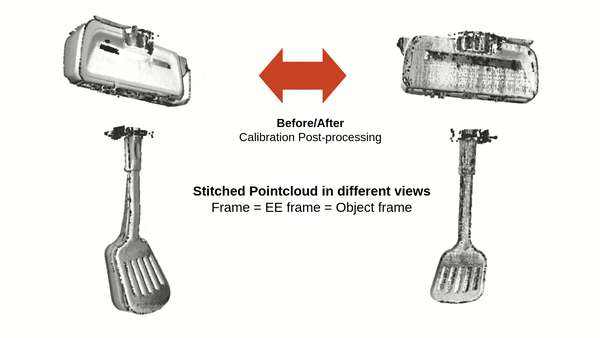
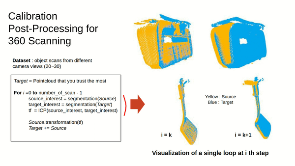
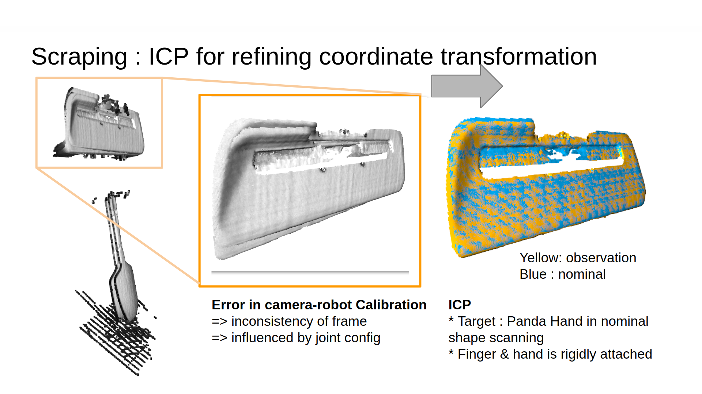

# pointcloud_postprocessing




# Table of contents
* [General info](#general-info)
* [Technologies](#technologies)
* [How to use](#Codes)
	* [construct_3d_model.py](#construct_3d_model.py)  
	* [dataprocessing.py](#dataprocessing.py)  


# General info
This repository is mainly about post-processing pointcloud's frame obtained from Depth camera (ex. Photoneo) and RGB-D (ex. Intel Realsense). 
It assumes when pointcloud is generated from the *moving frame* (ex. End Effector Frame, Tool Frame), containing inconsistent calibration errors.
What this project does is to compensate the calibration errors through ICP. The desirable outcome is to reduce the camera to moving object frame calibration error (<0.5mm)

# Installation
```
git clone https://github.com/MMintLab/pointcloud_postprocessing.git
```

# Dependencies
Project is created with:
Installation | Version
------------ | -------------
python | 3.7.0
numpy | 1.21.2
open3d | 0.13.0

# Dataset Preparation
Create a data folder in your directory 
```
$ mkdir data
```
Feel free to design the data directory according to your need. Again, the data files(.ply) are returned from the object frame containing mild calibration error.

Example: 
```
├── data
│   ├── nominal_pcd
│   ├── obj1
│   │   │── task1
│   │   │── task2
│   │   │── ...
│   ├── obj2
│   │   │── task1
│   │   │── task2
│   │   │── ...
```


# How to use

## contruct_3d_model.py
This code is for constructing 360[deg] 3D object models scanned with Robot.\


**Input** : 0,1, ... , N scans pointcloud scanned from different angles.\
**Output** : 0,1, ... , N scans stitched together as a single object. The ply file saved in your desired directory that you will define as *DATA_SAVE_DIR*. \
**Task** 
1.  From 0,1, ... , N scans, it stitches pointcloud iteratively. 
2. For each iteration (for each scab), it compensates calibration error through ICP. I suggest doing ICP with Robot hand where EE frame is attached.


## dataprocessing.py

**Input** : 0,1, ... , M pointclouds of moving objects during robotic tasks. \
**Output** : 0,1, ... , M pointclouds returned in the consistent frame. The pointcloud with the target frame is set as *TARGET_DIR*. It can either be one of your 0~M pointclouds or the output of the *construct_3d_model.py*. If an object you are interested in deforms during the manipulation, we suggest using the latter option.
